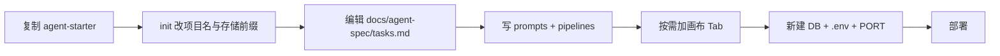

# agent-starter 项目前期设计说明

| 项 | 内容 |
| --- | --- |
| **文档状态** | 前期设计（Pre-design） |
| **创建日期** | 2026-06-05 |
| **母版来源** | 本仓库 `do1_smart_cto`（Smart CTO） |
| **目标产物** | 独立 git 仓库 `agent-starter`，供复制后快速衍生各场景 Agent |
| **范围外** | 多 Agent 共用同一后端、运行时 manifest 热加载、npm 平台包（首期不做） |

---

## 1. 背景与目标

Smart CTO 已具备较完整的「结构化 Agent」形态：

- 左侧任务进展 + 任务动态卡
- 顺序任务线、当前任务持久化、重启/审计
- 推理图（Token → Feature → LogicLink）与 Tree/逻辑弹层
- LLM 编排范式（`build*Input` → `run*Pipeline` → sync 落库 → 进度叙事）
- 右侧画布 Tab 交付物
- 分形文档与多角色 Cursor 协作（`AGENTS.md`、`docs/agents/`）

**目标**：从 Smart CTO **裁剪**出一套 **agent-starter** 模板仓库。后续每个业务 Agent（招聘顾问、法务审查等）通过 **复制 starter → 改任务与提示词 → 独立部署** 完成，而非在 Smart CTO 仓库内继续堆叠。

**产品定位**：

| 仓库 | 定位 |
| --- | --- |
| `do1_smart_cto` | 完整产品（16+ 步设计任务线等），持续演进 |
| `agent-starter` | 最小可运行模板（建议 3～5 步示例任务） |
| `your-*-agent` | 从 starter 复制的具体 Agent 实例 |

---

## 2. 核心架构决策

### 2.1 一 Agent 一仓库、一后端、一数据库

每个 Agent **独立**拥有：

- 独立 git 仓库
- 独立 `backend/.env` 与 MySQL **库名**
- 独立后端进程与（建议）独立 **PORT**
- 独立前端构建与部署

**不做**（首期）：

- 多 Agent 路由前缀（如 `/agent/:id/...`）
- 共享后端上的 `agentType` 多租户字段
- 运行时从 YAML 动态注册任务线（可二期再抽）

### 2.2 与 Smart CTO 的演进关系

```text
smart-cto  ──(一次性复制/裁剪)──►  agent-starter  ──(复制)──►  各独立 Agent
     │                                    │
     └──────── 无自动同步 ────────────────┘
```

- Smart CTO 继续作为「重度业务实例」演进。
- agent-starter 只保留通用运行时子集。
- 公共 bugfix（如 Tree 组件）可按需 **cherry-pick**，不强制双向同步。

---

## 3. 创建方式：复制文件夹（推荐）

### 3.1 推荐步骤

```bash
# 1. 复制（排除 node_modules、.git、敏感 .env）
rsync -a \
  --exclude node_modules \
  --exclude .git \
  --exclude backend/.env \
  do1_smart_cto/ agent-starter/

cd agent-starter

# 2. 断开与原仓库 git 历史（推荐）
rm -rf .git && git init

# 3. Cursor：File → Open Folder → 仅打开 agent-starter 目录
# 4. 在副本内裁剪，勿在 do1_smart_cto 内直接改结构
```

### 3.2 是否会影响 Smart CTO？

| 做法 | 是否影响 smart-cto |
| --- | --- |
| 复制到新目录，Cursor **只打开 agent-starter** | **否** |
| 在 `do1_smart_cto` 仓库内删除/重命名 design-detail 等 | **是** |
| 同仓不同分支 / git worktree | 合并进 main 前 **否** |

**结论**：并列两个文件夹 + 新 git 仓库，是对 Smart CTO **最安全** 的路径。

---

## 4. 从 Smart CTO 抽象的分层

### 4.1 平台层（agent-starter 应保留）

| 模块 | 能力 | Smart CTO 参考位置 |
| --- | --- | --- |
| 鉴权 + API | 登录、模型配置、LLM 代理 | `frontend-vue/src/api/`、`backend` auth/ai |
| 案例会话 | 一次 Agent 会话 = 一个 case | `ProblemCase`、聊天与 bundle API |
| 任务运行时 | 顺序、当前任务、完成态、自动推进 | `designModeTaskPipeline.ts`、`designDetailLineState.ts` |
| 工作区 UI 壳 | 左进展 + 右画布 Tab、使用/调试模式 | `DesignDetailPage.vue`、`DesignTaskDynamicsCard.vue` |
| 推理图 | Token / Feature / Link、Tree/逻辑 | Prisma 三表、`design-detail-graph-ids.ts`、Logic/Tree 弹层 |
| LLM 编排范式 | pipeline → sync → 进度叙事 | `runTask*` / `buildTask*` 模式 |
| 重启与审计 | 重启当前、LLM 日志 | `designDetailRestartScope.ts`、`llm-logs` |
| 协作治理 | 分形文档、多角色 agent 面板 | 根 `AGENTS.md`、`docs/agents/`、`.cursor/rules/` |

### 4.2 业务层（各 Agent 替换，starter 留 3～5 步示例）

| 内容 | Smart CTO 现状 | starter 策略 |
| --- | --- | --- |
| 任务数量与名称 | 16+ 步设计任务线 | 3～5 步示例 |
| 提示词 | `design_mode_promts.md`、`designDetailL*SystemPrompt.js` | `docs/agent-spec/prompts.md` + 少量 prompt 文件 |
| Pipeline | 100+ `runTask*` / `buildTask*` | 每步 1 个示例 pipeline |
| 画布 Tab | 现状理解、架构清单、ER、报告等 | 1～2 个示例 Tab |
| 领域语义 | BMC、IT-Gap、VSM、工商提炼等 | 删除或改为占位示例 |

### 4.3 文档真源（裁剪后建议）

将 Smart CTO 的 `design_mode_*.md` 范式收敛为：

```text
docs/agent-spec/
├── tasks.md      # 任务线顺序、id、中文名（类似 design_mode_tasks.md）
├── prompts.md    # 各环节 LLM 提示词台账（类似 design_mode_promts.md）
└── ux.md         # 任务动态、进度卡、交互协议（类似 design_mode_ux.md）
```

代码须与上述三文件对齐；变更任务 id 或提示词时同步更新。

---

## 5. 目标仓库结构（裁剪完成后）

```text
agent-starter/
├── README.md                 # 上手：复制 → 改 5 处 → 跑起来
├── docs/
│   ├── agent-spec/           # 本模板 Agent 的任务/提示词/UX 真源
│   └── agents/               # Cursor 多角色协作（可从 smart-cto 复制并改定位）
├── .cursor/
├── backend/
│   └── src/modules/...       # 首期可仍名 problem-cases；二期可泛化为 workspace
├── frontend-vue/
│   └── src/workspace/        # 从 design-detail 裁剪；或暂保留 design-detail 名再逐步改名
├── frontend/                 # 可选：若保留首页 + config.local.js
└── scripts/
    └── init-agent.sh         # 可选：复制衍生 Agent 时替换项目名/存储前缀
```

**Starter 内置示例任务线（建议 3 步）**：

| 顺序 | 示例 id | 示例名称 | 验证能力 |
| --- | --- | --- | --- |
| 1 | `intake_basic` | 信息收集 | 用户输入 + 首轮 LLM 结构化 |
| 2 | `analysis_inference` | 推理分析 | 读 task-graph 上游 + LLM + 落库 |
| 3 | `conclusion_output` | 结论输出 | 画布 Tab + 收官 |

跑通后再按 `docs/agent-spec/tasks.md` 扩展第 4、5 步。

---

## 6. 命名策略（裁剪期可选，衍生 Agent 建议做）

| Smart CTO | agent-starter 建议 |
| --- | --- |
| `design-detail` | `workspace` 或 `{agent}-workspace` |
| `DesignDetail*`（Prisma/代码） | 首期可保留；二期改为 `InferenceTaskToken` 等 |
| `smart_cto_*`（localStorage） | `{{agent_id}}_*` |
| `design_mode_*.md` | `docs/agent-spec/*.md` |
| 数据库名 `do1_smart_cto` | `agent_starter`（或各 Agent 独立库名） |

**原则**：先删业务、保留壳；大规模重命名放在跑通 3 步闭环之后。

---

## 7. 数据库与环境配置

agent-starter **继续使用 MySQL + Prisma**，与 Smart CTO 技术栈一致；**必须与 Smart CTO 使用不同数据库名**。

### 7.1 隔离对照（本机同时跑两个项目）

| 项 | smart-cto | agent-starter |
| --- | --- | --- |
| MySQL 服务 | 可共用同一实例 | 同上 |
| **库名** | 如 `do1_smart_cto` | 如 `agent_starter` |
| `backend/.env` | 各自一份 | **新建**，勿复制含密钥的旧文件 |
| 后端 PORT | 如 `3002` | 建议 **`3003`** |
| 前端 API | `config.local.js` → `BACKEND_API_URL` | 指向新端口 |

### 7.2 一键建库（推荐）

```bash
# 仓库根目录（macOS / Linux）
bash scripts/init-agent-starter-db.sh

# 或仅在 backend 目录
cd backend && npm run db:init
```

脚本会依次：从 `backend/docs/dotenv.local.template` 生成 `backend/.env`（若缺失）、从 `frontend/config.local.example.js` 生成 `config.local.js`（若缺失）、`CREATE DATABASE agent_starter` 并授权 `smart_cto_app@127.0.0.1`、`prisma db push`、确保管理员 **root/root**（修正 `local-dev-placeholder-hash` 占位哈希）。

### 7.3 手动建库

```sql
CREATE DATABASE agent_starter
  CHARACTER SET utf8mb4
  COLLATE utf8mb4_unicode_ci;
```

### 7.4 `backend/.env` 示例

参考 `backend/docs/dotenv.local.template`（本地）或 `backend/docs/dotenv.production.template`（生产）：

```env
NODE_ENV=development
HOST=0.0.0.0
PORT=3003

DATABASE_URL="mysql://用户名:密码@127.0.0.1:3306/agent_starter"

JWT_SECRET=<随机长字符串>
AI_CONFIG_ENCRYPTION_SECRET=<随机长字符串>
```

生成密钥：

```bash
cd backend
node scripts/generate-deploy-secrets.cjs
```

### 7.5 同步表结构

```bash
cd backend
npm install
npm run prisma:generate
npx prisma db push          # 本地开发
# 或 npx prisma migrate deploy   # 生产/规范环境
```

表结构来自复制过来的 `backend/prisma/schema.prisma`（含 `ProblemCase`、`DesignDetailTaskToken`、`DesignFeatureNode`、`DesignLogicLink` 等）。**仅写入新库，不影响 Smart CTO 库。**

### 7.6 启动后端

与 Smart CTO 相同，使用统一脚本（勿拆步省略 db push / build）：

```bash
# macOS / Linux
bash backend/scripts/start-local-backend.sh

# Windows
powershell -File backend/scripts/start-local-backend.ps1
```

说明见 `backend/scripts/README-local.md`。

### 7.7 前端指向新后端

`frontend/config.local.js`（通常 gitignore，需本地新建）：

```javascript
window.APP_CONFIG = Object.assign(window.APP_CONFIG || {}, {
  MODE: 'online',
  BACKEND_API_URL: 'http://127.0.0.1:3003/api',
});
```

### 7.8 验证

```bash
curl http://127.0.0.1:3003/health
```

MySQL：`USE agent_starter; SHOW TABLES;` 应出现 Prisma 表且无 Smart CTO 业务数据。

---

## 8. 裁剪策略与阶段

### 8.1 原则

1. **先配库、跑通 3 步闭环，再删 Smart CTO 专用代码**。
2. **先删业务、保留壳**；不要先大规模重命名。
3. 删坏了可从 smart-cto **重新复制** 一份。

### 8.2 阶段划分

| 阶段 | 产出 | 预估 |
| --- | --- | --- |
| **Phase 0** | 本文档 + 复制仓库 + 独立建库跑通 health | 0.5～1 天 |
| **Phase 1** | 裁成 3 步可运行 starter（保留推理图/重启/审计壳） | 1～2 周 |
| **Phase 2** | `docs/agent-spec/` 真源 + README 上手说明 + 可选 `init-agent.sh` | 2～3 天 |
| **Phase 3** | 第一个非 Smart CTO 衍生 Agent 验证复制流程 | 3～7 天/Agent |

### 8.3 裁剪清单（Phase 1 方向性）

**建议保留**：

- `frontend-vue`：鉴权、API client、`design-detail` 壳（或改名为 workspace）
- `backend`：auth、ai、`problem-cases` 核心 API、Prisma、task-graph、llm-logs
- 推理图三表相关读写、Tree/Logic 弹层（若模板需要）
- 1 条完整 pipeline 样板（可参考 task2 L1 链路复杂度，或再简化）
- `.cursor/`、`AGENTS.md`、`docs/agents/` 协作范式

**建议删除或移出 starter**（Smart CTO 专用）：

- task3～14 大部分 `runTask*` / `buildTask*` / `designDetailTask*`
- Smart CTO 专用画布（现状理解、架构清单、ER、设计报告等 Tab）
- `tool-experience`、`tool-detail`（若模板不需要）
- legacy `frontend/main.js` 15 任务主链路（若 starter 只做 workspace 页 + 简易首页）
- 与 Smart CTO 领域强绑定的 sync API（task52/55/85/9… 等）可在验证 3 步后逐步删

详细文件级清单在 Phase 1 开工前由实施者对照目录导出一份「保留/删除」表，并回写本文档附录。

---

## 9. 衍生 Agent 开发流程



每次衍生约修改：

1. `*TaskPipeline.ts` — 任务 id、顺序、展示名  
2. `docs/agent-spec/prompts.md` + `*SystemPrompt.js`  
3. `pipelines/runTask*.ts` — 业务逻辑  
4. `task-graph-catalog.ts`（或等价）— 落库 taskId 映射  
5. 工作区页 — Tab、顶栏文案  
6. 首页入口 — 进入工作页的链接  

**不必改**（若 starter 已具备）：鉴权、LLM 代理、推理图 CRUD、Tree 布局、重启框架、进度卡 UI。

---

## 10. 风险与注意事项

| 风险 | 缓解 |
| --- | --- |
| 复制了 smart-cto 的 `.env`，两项目共库 | agent-starter **新建** `.env`，库名必须不同 |
| 本机双后端端口冲突 | agent-starter 使用 `PORT=3003`（或其它空闲端口） |
| 浏览器 localStorage 串登录态 | 不同端口；裁剪后改 `smart_cto_*` 前缀 |
| 在 smart-cto 仓内裁剪破坏产品 | **只在 agent-starter 副本操作** |
| 复制体积过大 | rsync 排除 `node_modules`、`.git` |
| 裁剪后文档与代码不一致 | 以 `docs/agent-spec/` 为真源，遵循分形文档触发链 |

---

## 11. 验收口径（agent-starter Phase 1 完成）

- [ ] 独立 git 仓库，与 `do1_smart_cto` 无共享 remote 误配  
- [ ] `backend/.env` 指向独立库；`prisma db push` / migrate 成功  
- [ ] `/health` 正常；可登录、可创建 case  
- [ ] 3 步示例任务线可跑通：输入 → LLM → task-graph 落库 → 进度卡 → 至少 1 个画布 Tab  
- [ ] 重启当前、LLM 审计（若保留）可用  
- [ ] `docs/agent-spec/{tasks,prompts,ux}.md` 与代码一致  
- [ ] README 说明：如何复制 starter 再衍生新 Agent  

---

## 12. 后续行动（建议顺序）

1. 按 §3 复制出 `agent-starter` 目录并 `git init`。  
2. 按 §7 配置独立数据库与 `.env`，确认 `/health`。  
3. 在 Cursor 中仅打开 agent-starter，执行 Phase 1 裁剪。  
4. 回写本文档「实施状态」与文件级裁剪附录。  
5. 用第一个试点 Agent（5 步以内、画布从简）验证复制流程。  

---

## 13. 修订记录

| 日期 | 摘要 |
| --- | --- |
| 2026-06-05 | 初稿：汇总 smart-cto → agent-starter 的目标、复制方式、独立库配置、裁剪与验收口径 |

---

## 附录 A：Smart CTO 关键代码索引（裁剪时查阅）

| 概念 | 路径 |
| --- | --- |
| 任务线顺序与中文名 | `frontend-vue/src/design-detail/designModeTaskPipeline.ts` |
| 任务/提示词/UX 台账 | `design_mode_tasks.md`、`design_mode_promts.md`、`design_mode_ux.md` |
| 聊天与任务编排主入口 | `frontend-vue/src/design-detail/useDesignDetailChat.ts` |
| 推理图落库 taskId 目录 | `backend/src/modules/problem-cases/design-detail-task-graph-catalog.ts` |
| 图主键分配 | `backend/src/modules/problem-cases/design-detail-graph-ids.ts` |
| Prisma 模型 | `backend/prisma/schema.prisma` |
| 本地后端启动 | `backend/scripts/README-local.md` |
| 环境变量模板 | `backend/docs/dotenv.production.template` |
